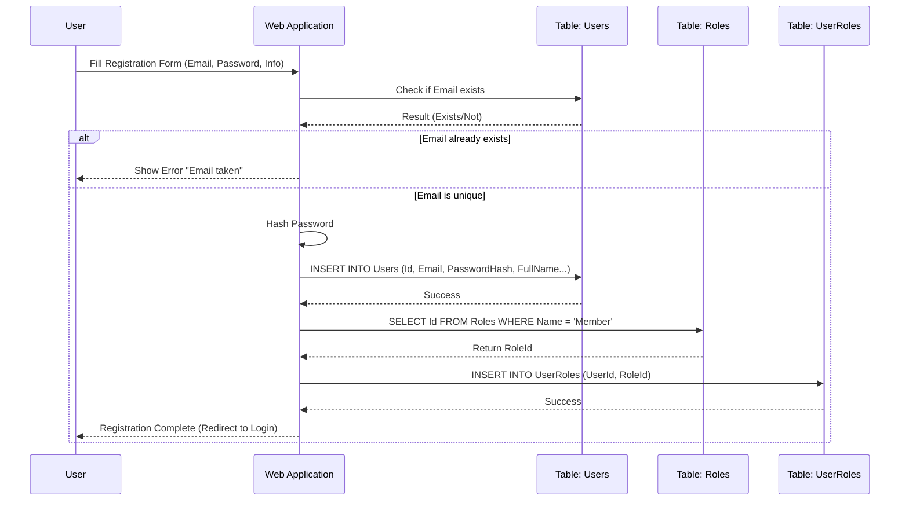
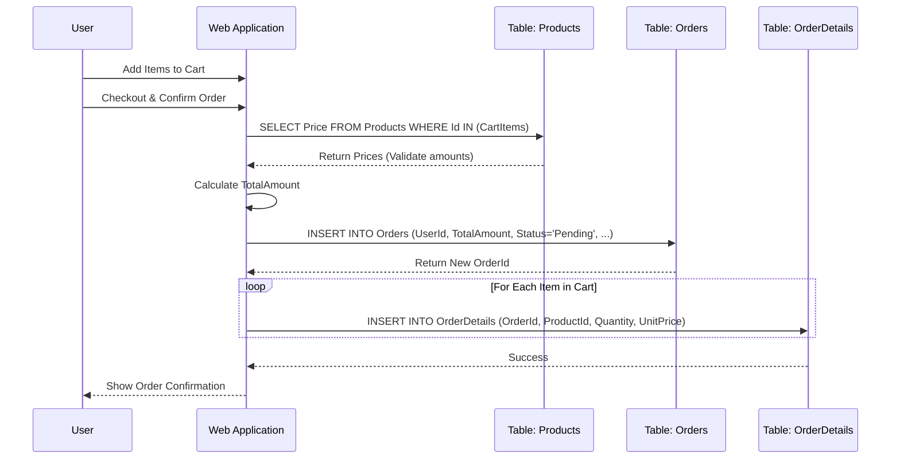
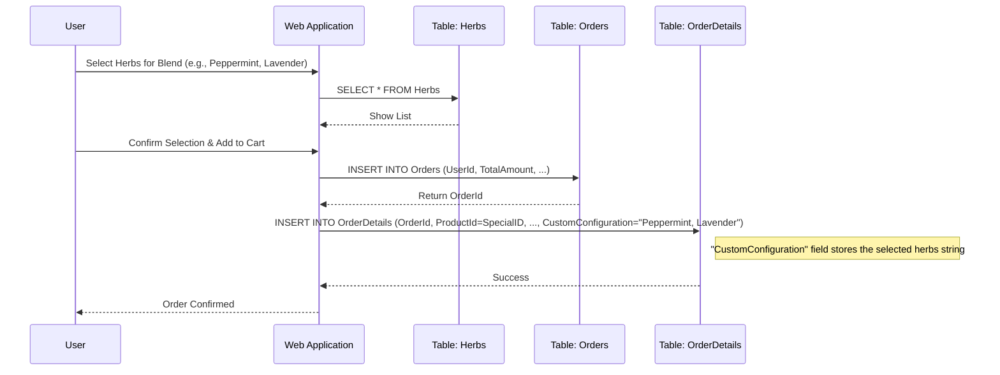
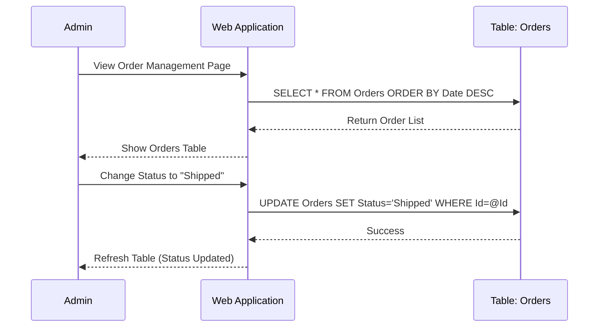
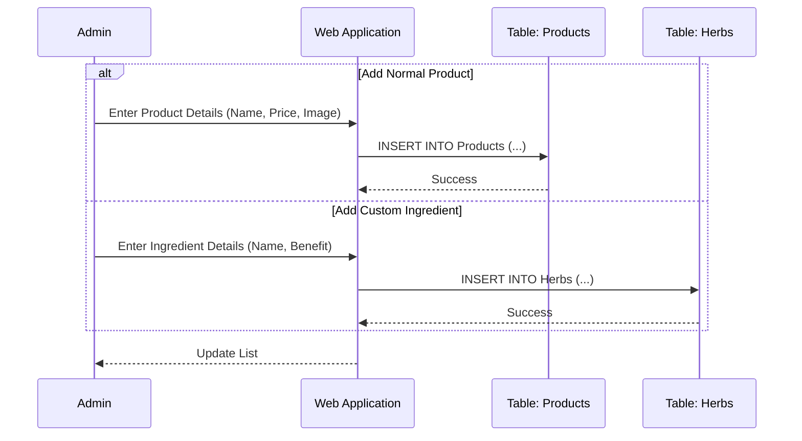

# Database Sequence Diagrams (System Flow)

## 1. User Registration Flow (สมัครสมาชิก)
Interaction between User, Web Application, and Identity Tables (`Users`, `Roles`, `UserRoles`).

## 2. Product Purchase Flow (การสั่งซื้อสินค้า)
Interaction when a user places a normal order involving `Orders` and `OrderDetails`.

## 3. Custom Blend Order Flow (สั่งปรุงน้ำหอม/ยาดม)
Interaction for the Custom Inhaler feature involving `Herbs` and `OrderDetails` configuration.

## 4. Admin Update Order Status (จัดการสถานะออเดอร์)
Admin updates an order from "Pending" to "Shipped".

## 5. Admin Manage Products (จัดการสินค้า)
Adding a new product or ingredient.

