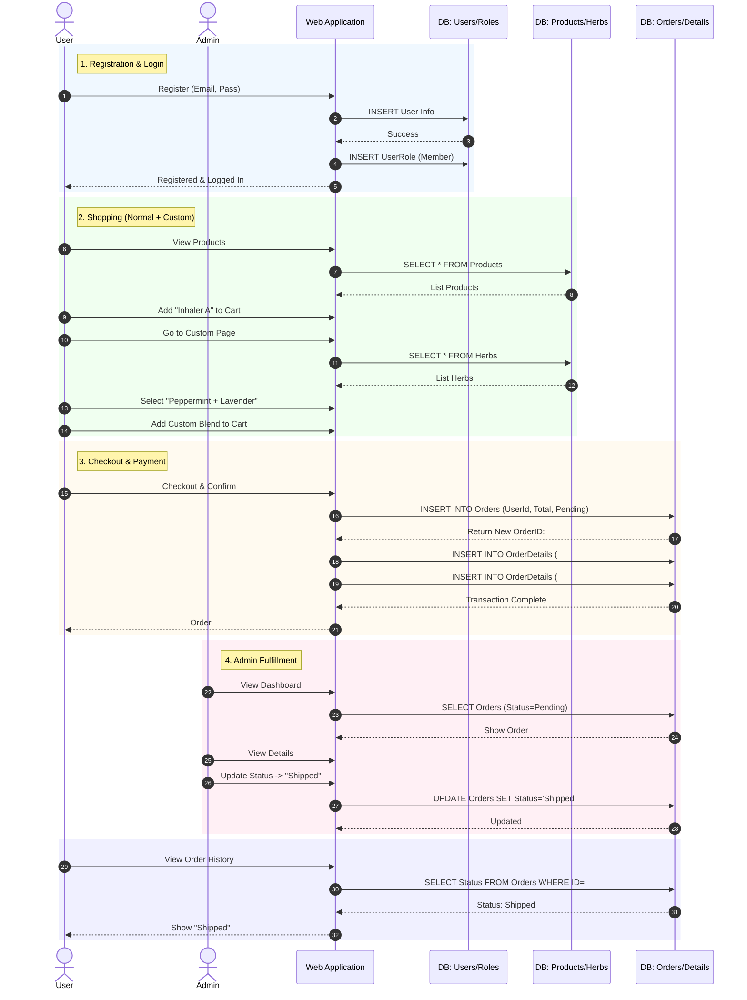

# System Overview Sequence Diagram

## Comprehensive System Flow
This diagram illustrates the entire lifecycle from Registration -> Shopping -> Checkout -> Admin Management.

```mermaid
sequenceDiagram
    autonumber
    actor User
    actor Admin
    participant WebApp as Web Application
    participant DB_Identity as DB: Users/Roles
    participant DB_Catalog as DB: Products/Herbs
    participant DB_Sales as DB: Orders/Details

    %% --- Registration Flow ---
    rect rgb(240, 248, 255)
        note right of User: 1. Registration & Login
        User->>WebApp: Register (Email, Pass)
        WebApp->>DB_Identity: INSERT User Info
        DB_Identity-->>WebApp: Success
        WebApp->>DB_Identity: INSERT UserRole (Member)
        WebApp-->>User: Registered & Logged In
    end

    %% --- Shopping Flow (Mix of Normal & Custom) ---
    rect rgb(240, 255, 240)
        note right of User: 2. Shopping (Normal + Custom)
        
        %% Normal Product
        User->>WebApp: View Products
        WebApp->>DB_Catalog: SELECT * FROM Products
        DB_Catalog-->>WebApp: List Products
        User->>WebApp: Add "Inhaler A" to Cart
        
        %% Custom Blend
        User->>WebApp: Go to Custom Page
        WebApp->>DB_Catalog: SELECT * FROM Herbs
        DB_Catalog-->>WebApp: List Herbs
        User->>WebApp: Select "Peppermint + Lavender"
        User->>WebApp: Add Custom Blend to Cart
    end

    %% --- Checkout Flow ---
    rect rgb(255, 250, 240)
        note right of User: 3. Checkout & Payment
        User->>WebApp: Checkout & Confirm
        
        %% Create Order Header
        WebApp->>DB_Sales: INSERT INTO Orders (UserId, Total, Pending)
        DB_Sales-->>WebApp: Return New OrderID: #101

        %% Insert Details (Normal)
        WebApp->>DB_Sales: INSERT INTO OrderDetails (#101, ProductID: Inhaler A)
        
        %% Insert Details (Custom)
        WebApp->>DB_Sales: INSERT INTO OrderDetails (#101, Custom: "Peppermint, Lavender")
        
        DB_Sales-->>WebApp: Transaction Complete
        WebApp-->>User: Order #101 Placed
    end

    %% --- Admin Management Flow ---
    rect rgb(255, 240, 245)
        note right of Admin: 4. Admin Fulfillment
        Admin->>WebApp: View Dashboard
        WebApp->>DB_Sales: SELECT Orders (Status=Pending)
        DB_Sales-->>WebApp: Show Order #101
        
        Admin->>WebApp: View Details #101 (See Custom Formula)
        Admin->>WebApp: Update Status -> "Shipped"
        WebApp->>DB_Sales: UPDATE Orders SET Status='Shipped'
        DB_Sales-->>WebApp: Updated
    end
    
    %% --- User Tracking ---
    rect rgb(240, 240, 255)
        User->>WebApp: View Order History
        WebApp->>DB_Sales: SELECT Status FROM Orders WHERE ID=#101
        DB_Sales-->>WebApp: Status: Shipped
        WebApp-->>User: Show "Shipped"
    end
```
